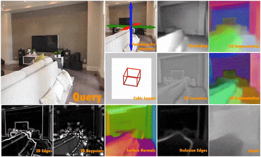
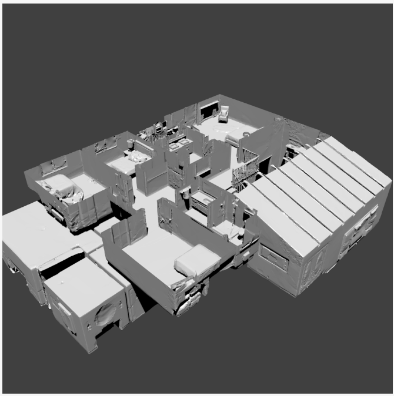

# [Taskonomy: Disentangling Task Transfer Learning](https://taskonomy.vision/)

This repository contains [pretrained models](https://github.com/StanfordVL/taskonomy/tree/master/taskbank) and [sample data](https://github.com/StanfordVL/taskonomy/tree/master/data) for the following paper

#### [Taskonomy: Disentangling Task Transfer Learning](https://taskonomy.vision/) (CVPR 2018, Best Paper Award)

Amir R. Zamir, Alexander Sax*, William B. Shen*, Leonidas Guibas, Jitendra Malik, Silvio Savarese. 


| [TASK BANK](https://github.com/StanfordVL/taskonomy/tree/master/taskbank) | [DATASET](https://github.com/StanfordVL/taskonomy/tree/master/data) |
|:-----|:-----|
| The `taskbank` folder contains information about our pretrained models, and scripts to download them. There are sample outputs, and links to live demos. | The `data` folder contains information and statistics about the dataset, some sample data, and instructions for how to download the full dataset. |
| [](https://github.com/StanfordVL/taskonomy/tree/master/taskbank) | [](https://github.com/StanfordVL/taskonomy/tree/master/data) |


## Citation
If you find the code, models, or data useful, please cite this paper:
```
@inproceedings{zamir2018taskonomy,
  title={Taskonomy: Disentangling Task Transfer Learning},
  author={Zamir, Amir R and Sax, Alexander and and Shen, William B and Guibas, Leonidas and Malik, Jitendra and Savarese, Silvio},
  booktitle={2018 IEEE Conference on Computer Vision and Pattern Recognition (CVPR)},
  year={2018},
  organization={IEEE}
}
```
<!--- #### See more info about TASK BANK here: https://taskonomy.vision/#models
#### Try the live demo here: https://taskonomy.vision/tasks
## More of code, models, and dataset of Taskonomy coming soon. 
(repository under construction) --->
