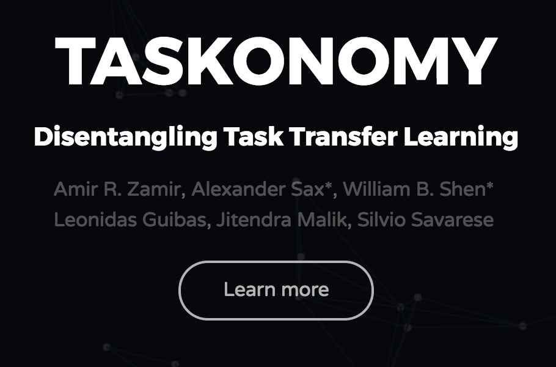

# [Taskonomy: Disentangling Task Transfer Learning](https://taskonomy.vision/)

This repository contains:
- [pretrained models (task bank)](https://github.com/StanfordVL/taskonomy/tree/master/taskbank)
- [dataset](https://github.com/StanfordVL/taskonomy/tree/master/data)
- [reference code](https://github.com/StanfordVL/taskonomy/tree/master/code)
- [task affinity analyses and results](https://github.com/StanfordVL/taskonomy/tree/master/results)

for the the following paper:

#### [Taskonomy: Disentangling Task Transfer Learning](https://taskonomy.vision/) (CVPR 2018, Best Paper Award)
Amir Zamir, Alexander Sax*, William Shen*, Leonidas Guibas, Jitendra Malik, Silvio Savarese. 


| [TASK BANK](https://github.com/StanfordVL/taskonomy/tree/master/taskbank) | [DATASET](https://github.com/StanfordVL/taskonomy/tree/master/data) |
|:-----|:-----|
| The `taskbank` folder contains information about our pretrained models, and scripts to download them. There are sample outputs, and links to live demos. | The `data` folder contains information and statistics about the dataset, some sample data, and instructions for how to download the full dataset. |
| [](https://github.com/StanfordVL/taskonomy/tree/master/taskbank) | [](https://github.com/StanfordVL/taskonomy/tree/master/data) |

| [Task affinity analyses and results](https://github.com/StanfordVL/taskonomy/tree/master/results)| [Website](http://taskonomy.vision/) |
|:----|:----|
| This folder contains the raw and normalized data used for measuring task affinities. | The webpage of the project with links to assets and demos. |
|[](https://github.com/StanfordVL/taskonomy/tree/master/results) | [](http://taskonomy.vision/)|


 
 


## Citation
If you find the code, models, or data useful, please cite this paper:
```
@inproceedings{zamir2018taskonomy,
  title={Taskonomy: Disentangling Task Transfer Learning},
  author={Zamir, Amir R and Sax, Alexander and and Shen, William B and Guibas, Leonidas and Malik, Jitendra and Savarese, Silvio},
  booktitle={2018 IEEE Conference on Computer Vision and Pattern Recognition (CVPR)},
  year={2018},
  organization={IEEE}
}
```
<!--- #### See more info about TASK BANK here: https://taskonomy.vision/#models
#### Try the live demo here: https://taskonomy.vision/tasks
## More of code, models, and dataset of Taskonomy coming soon. 
(repository under construction) --->
