# TASKONOMY Dataset 

<div align="center">
  
</div>

**Annotations of a sample image.** Labels are shown for a subset of 15 tasks.

## Intro 


This repository shares a multi-annotated dataset from the following paper:

**Taskonomy: Disentangling Task Transfer Learning**, CVPR 2018.
Amir R. Zamir, Alexander Sax*, William B. Shen*, Leonidas Guibas, Jitendra Malik, Silvio Savarese. 

The dataset includes over 4.5 million images from over 500 buildings. **Each image has annotations for every one of the 2D, 3D, and semantic tasks in Taskonomy's dictionary** (see below). The total size of the dataset is 11.16 TB. For more details, please see the [CVPR 2018 paper](http://taskonomy.vision/#paper).

Here we are sharing a single model (only a small fraction of the dataset) as a sample. For the full dataset, please contact the authors to receive the download instructions. 

#### Website and sample data
| [Website](http://taskonomy.vision/) | [See sample model](https://github.com/alexsax/taskonomy-sample-model-1)|
|:----:|:----:|
| [](http://taskonomy.vision/)|```Cauthron``` [](https://github.com/alexsax/taskonomy-sample-model-1)|


## Contents 
- [Intro](#intro)
- [Website and sample model](#website-and-sample-data)
- [Data Statistics](#data-statistics)
  - Image-level statistics
  - Point-level statistics
  - Camera-level statistics
  - Model-level statistics
- [Dataset Splits](#dataset-splits)
- [Explanation of folder structure and points](#data-structure)
- [Citation](#citation)


## Data Statistics
The dataset consists of over **4.6 million images** from **537 different buildings**. The images are from **indoor scenes**. Images with people visible were exluded and we didn't include camera roll (pitch and yaw included). Below are some statistics about the images which comprise the dataset.

### Image-level statistics

| Property | Mean | Distribution |
|----|---|----|
| **Camera Pitch** | 0.24° | 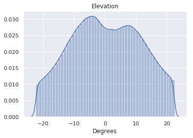 | 
| **Camera Roll** | 0.0° | 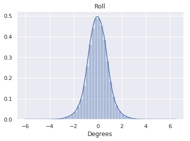  | 
| **Camera Field of View** | 61.2° | 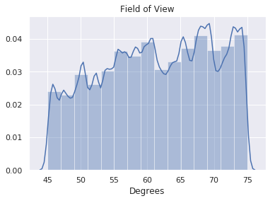  |
| **Distance**  (from camera to scene content)| 5.3m | 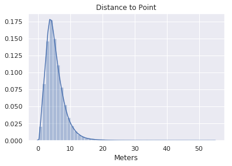  |
| **3D Obliqueness of Scene Content** (wrt camera)| 52.9° | 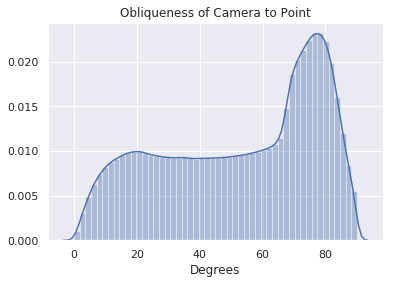  |
| **Points in View** (for point correspondences) | (median) 55 | 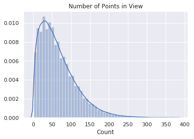  |

### Point-level statistics

| Property | Mean | Distribution |
|----|---|----|
| **Cameras per Point** | (median) 5 | 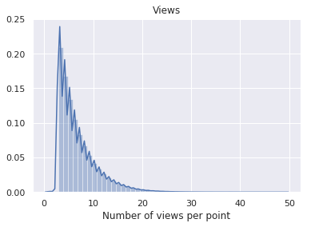 | 


### Camera-level statistics

| Property | Mean | Distribution |
|----|---|----|
| **Points/Camera** | 20.8 | 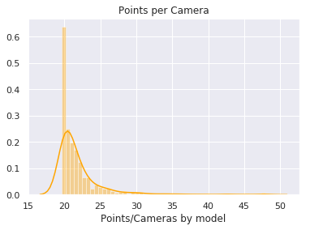 | 

### Model-level Statistics

| Property | Mean | Distribution |
|----|---|----|
| **Image Count** | 0.0° | 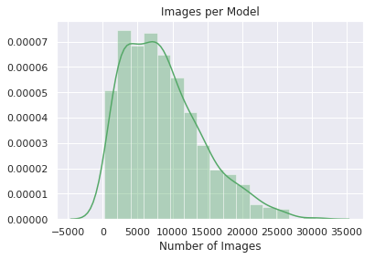  | 
| **Point Count** | -0.77° | 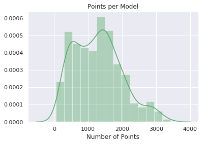 | 
| **Camera Count** | 75° | 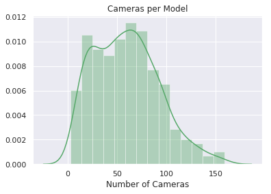   |


# Data structure
A model, selected at random, from the training set of the paper is shared in the repository. The folder structure is described below:
  
```
class_object/
    Object classification (Imagenet 1000) annotation distilled from ResNet-152
class_scene/
    Scene classification annotations distilled from PlaceNet
depth_euclidean/
    Euclidian distance images.
           Units of 1/512m with a max range of 128m.
depth_zbuffer/
   Z-buffer depth images.
       Units of 1/512m with a max range of 128m.
edge_occlusion/
    Occlusion (3D) edge images.
edge_texture/ 
    2D texture edge images.
keypoints2d/
    2D keypoint heatmaps.
keypoints3d/
    3D keypoint heatmaps.
nonfixated_matches/
    All (point', view') which have line-of-sight and a view of "point" within the camera frustum
normal/
    Surface normal images.
        127-centered
points/
    Metadata about each (point, view).
    For each image, we keep track of the optical center of the image.
    This is uniquely identified by the pair (point, view).
        Contains annotations for:
             Room layout
             Vanishing point
             Point matching
             Relative camera pose esimation (fixated)
             Egomotion
        And other low-dimensional geometry tasks. 
principal_curvature/
    Curvature images. 
        Principal curvatures are encoded in the first two channels.
        Zero curvature is encoded as the pixel value 127
reshading/
    Images of the mesh rendered with new lighting.
rgb/
    RGB images in 512x512 resolution.
rgb_large/
    RGB images in 1024x1024 resolution.
segment_semantic/
    Semantic segmentation annotations distilled from [FCIS](https://arxiv.org/pdf/1611.07709.pdf)
segment_unsup2d/
   Pixel-level unsupervised superpixel annotations based on RGB.
segment_unsup25d/
    Pixel-level unsupervised superpixel annotations based on RGB + Normals + Depth + Curvature.
```
## Dataset Splits
We provide standard train/validation/test splits for the dataset to standardize future benchmarkings. The split files can be accessed [here](https://github.com/StanfordVL/taskonomy/raw/master/data/assets/splits_taskonomy.zip). Given the large size of the full dataset, we provide the standard splits for 4 partitions (`Tiny`, `Medium`, `Full`, `Full+`) with increasing sizes (see below) which the users can employ based on their storage and computation resources. `Full+` is inclusive of `Full`, `Full` is inclusive of `Medium`, and `Medium` is inclusive of `Tiny`.


| Split Name   |      Train     |  Val  |  Test |
|----------|:-------------:|-------------:|------:| 
| Tiny |  25 | 5 | 5 | 
| Medium |  100 |  20 | 20 | 
| Full | 360 | 70 | 70 | 
| Full+ | 412 |  80 | 80 | 


## Citation

If you find the code, data, or the models useful, please cite this paper:
```
@inproceedings{zamir2018taskonomy,
  title={Taskonomy: Disentangling Task Transfer Learning},
  author={Zamir, Amir R and Sax, Alexander and Shen, William B and Guibas, Leonidas and Malik, Jitendra and Savarese, Silvio},
  booktitle={2018 IEEE Conference on Computer Vision and Pattern Recognition (CVPR)},
  year={2018},
  organization={IEEE}
}
```

