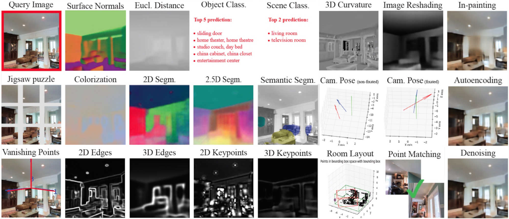
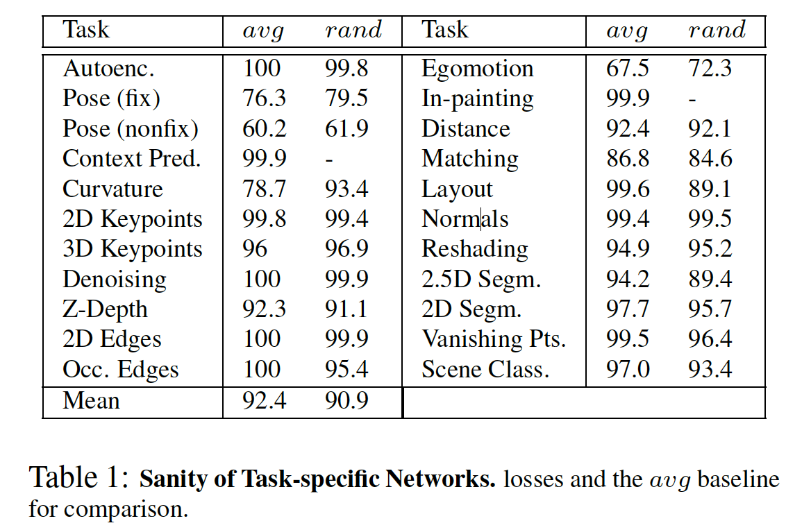
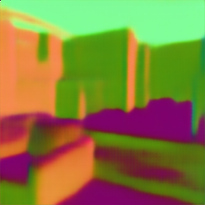
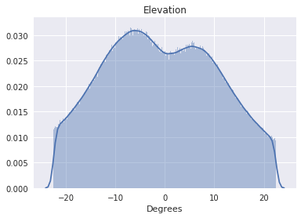
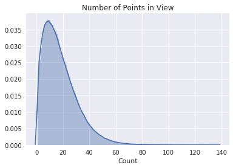

# TASK BANK: A Unified Bank of 25 Pretrained Vision Tasks

This repository provides a unified bank of pre-trained networks for 25 vision tasks. We provide pretrained models, code for running the models on arbitrary images, as well as code for visualizing results similar to the ones shown below and [here](https://taskonomy.vision/tasks). The figure below shows the task outputs given a query image (top left).

<div align="center">
  
</div>


### See sample results of the TASK BANK here: https://taskonomy.vision/#models
### Try the live demo here: https://taskonomy.vision/tasks
#### Paper: "Taskonomy: Disentangling Task Transfer Learning", CVPR 2018.
Amir R. Zamir, Alexander Sax*, William B. Shen*, Leonidas Guibas, Jitendra Malik, Silvio Savarese. 

http://taskonomy.vision/ 


## Introduction


These models are based on specific networks of the [Taskonomy](http://taskonomy.vision/) project.
For more extensive discussion about Taskonomy and transfer learning please see the [CVPR 2018 paper](http://taskonomy.vision/). This repository solely focuses on provding an easy to use unified bank for the pretrained vision tasks. 21 single image input tasks and 4 quadratic (2 input image) tasks are included. Single input tasks:


```
Autoencoder             Curvatures          Colorization             Denoising-Autoencoder 
Depth                   Edge-2D             Edge-3D                  Euclidean-Distance 
Inpainting              Jigsaw-Puzzle       Keypoint-2D              Keypoint-3D 
Object-Classification   Reshading           Room-Layout              Scene-Classification 
Segmentation-2D         Segmentation-3D     Segmentation-Semantic    Surface-Normal       
Vanishing-Point
```

The 4 quadratic tasks:

```
Pairwise-Nonfixated-Camera-Pose Pairwise-Fixated-Camera-Pose
Triplet-Fixated-Camera-Pose     Point-Matching
``` 
<div align="center">
  
</div>

### Network Architecture

As shown in the top figure, each task shares the same encoder architexture. The encoder maps input image (256x256) into a representation of size 2048 (16x16x8). Encoder is modified based on [ResNet-50](https://arxiv.org/pdf/1512.03385.pdf) by: 1. replacing `conv5_1`'s stride 2 convolution with stride 1 convolution. 2. No global average pooling.

Since our task dictionary contains tasks of different dimensional output, we have a varying decoder architecture. We tried our best to keep the decoder structure compact and varies as little as possible. Also, for different tasks, there are different kind of loss being used. See below table for complete info.

<div align="center">
  
</div>

### Evaluation: How good are these networks?

See below table for loss comparison. The table shows the proportion of the time that the task network
beats average estimator (avg), i.e. the best statistically informed guess, and a network trained on random nonlinear projections (rand). More details discussed in [paper](http://taskonomy.vision/):

<div align="center">
  
</div>


## Installation

### Tensorflow

Install [Tensorflow](https://www.tensorflow.org/install/). We use Version 1.2.1.

### Python

See [`requirement.txt`](https://github.com/b0ku1/taskonomy/blob/master/requirement.txt) for a list of used packages

The easiest way to install them is through:
```bash
pip install -r requirement.txt --no-index
```

We recommend do a clean installment using virtualenv:
```bash
conda create -n testenv python=3.4
source activate testenv
pip install -r requirement.txt 
```

## Running Demo Single Image Input Task

### Step 0: Clone the Code from Github

```
git clone https://github.com/b0ku1/taskonomy.git
cd taskonomy
```

### Step 1: Downloading Pretrained Model

```
sh tools/download_model.sh
```

### Step 2: Run Demo Script

To run a pretrained model on a specific image, do:
```bash
python tools/run_img_task.py --task $TASK --img $PATH_TO_INPUT --store $WHERE_TO_STORE
```

For the `--task` flag, find the task name in [Task Name Dictionary](https://github.com/b0ku1/taskonomy/blob/master/tools/task_dict.txt), for example, according to the dictionary:
```
Surface-Normal : rgb2sfnorm
```

<div align="center">
  
  <p>Example Test Image</p>
</div>

Then, we can run the script on our [example image](https://github.com/b0ku1/taskonomy/blob/master/assets/test.png) as such:

```bash
python tools/run_img_task.py --task rgb2sfnorm --img assets/test.png --store assets/test_sf.png
```

Which will give us image [`test_sf.png`](https://github.com/b0ku1/taskonomy/blob/master/assets/test_sf.png):
<div align="center">
  
  <p>Test Image Surface Normal Estimation</p>
</div>

Similarly, low-dimensional task uses the same script. For example:
```
Scene-Classification : class_places
```
Again, we can run the script on our example image using:

```bash
python tools/run_img_task.py --task class_places --img assets/test.png --store assets/test_places.png
```

Which will give us image [`test_places.png`](https://github.com/b0ku1/taskonomy/blob/master/assets/test_places.png):
<div align="center">
  
  <p>Test Image Scene Classification</p>
</div>

For the `--store-rep` flag, it's for storing the representation of the image under the given task's encoder, add `--store-rep` flag to the command. Then the representation will be stored at `${WHERE_TO_STORE}.npy`. For example, running:
```bash
python tools/run_img_task.py --task class_places --img assets/test.png --store assets/test_places.png --store-rep
```
Will store the representation of the image's representation under Scene Classification encoder at `assets/test_places.npy`.

For the `--store-pred` flag, it's for storing the predicted output of the image under the given task, add `--store-pred` flag to the command. Then the representation will be stored at `${WHERE_TO_STORE}_pred.npy`. For example, running:
```bash
python tools/run_img_task.py --task class_places --img assets/test.png --store assets/test_places.png --store-pred
```
Will store the prediction of the image's Scene Classification result at `assets/test_places_pred.npy`.

## Running Demo Quadratic Images Input Task

### Step 1: Downloading Pretrained Model

```
sh tools/download_model_quadratic.sh
```

### Step 2: Run Demo Script

To run a pretrained quadratic model on specific images (in case of Triplet-Fixated-Camera-Pose, `--img` should be `$IMG1,$IMG2,$IMG3`), do:
```bash
python tools/run_quad_img_task.py --task $TASK --img $IMG1,$IMG2 --store $WHERE_TO_STORE
```
Similarly for the `--task` flag, find the task name in [Task Name Dictionary](https://github.com/b0ku1/taskonomy/blob/master/tools/task_dict.txt), for example, according to the dictionary:
```
Pairwise-Nonfixated-Camera-Pose : non_fixated_pose
```
<div align="center">
  
  <p>Camera Pose Input (left: test_1.png, right:test.png)</p>
</div>
Then, we can run the script on our [example image 1](https://github.com/b0ku1/taskonomy/blob/master/assets/test.png) and [example image 2](https://github.com/b0ku1/taskonomy/blob/master/assets/test_1.png) as such:

```bash
python tools/run_quad_img_task.py --task non_fixated_pose --img assets/test_1.png,assets/test.png --store assets/test_pose.png
```
Note: camera pose is calculate with reference to the second image (here is `test.png`).

The script will give us image [`assets/test_pose.png`](https://github.com/b0ku1/taskonomy/blob/master/test_places.png):
<div align="center">
  
  <p>Test Camera Pose (green is test.png, red is test_1.png)</p>
</div>
The ``--store-rep`` and ``--store-pred`` flag all work the same as `run_img_task.py`.


### Training Data Statistics

The dataset consists of **3.99 million images** from **2265 different buildings**. The images are **indoors** only. Below are some statistics about the images which comprise the training dataset. If your query images severly deviate from these statistics, the performance is expected to degrade. 

| Property | Mean | Distribution |
|----|---|----|
| **Camera Pitch** | -0.77° |  | 
| **Camera Roll** | 0.0° |   | 
| **Camera Field of view** | 75° | *Constant*  |
| **Distance**  (from camera to scene content)| 5.5m |   |
| **Obliqueness** (scene content wrt camera)| 52.5° |   |
| **Points in view** (for point correspondences) | (median) 15 |   |


### Citing

If you find the code or the models useful, please cite this paper:
```
@inproceedings{zamir2018taskonomy,
  title={Taskonomy: Disentangling Task Transfer Learning},
  author={Zamir, Amir R and Sax, Alexander and and Shen, William B and Guibas, Leonidas and Malik, Jitendra and Savarese, Silvio},
  booktitle={2018 IEEE Conference on Computer Vision and Pattern Recognition (CVPR)},
  year={2018},
  organization={IEEE}
}
```

### License

The code and models are released under the MIT License (refer to the [LICENSE](https://github.com/b0ku1/taskonomy/blob/master/LICENSE) file for details).
 

