<div align="center">
  
</div>

# TASK BANK: A Unified Bank of 25 Visual Estimators

This repository shares a unified bank of pretrained models for **25 vision tasks spanning a wide range of 2D, 3D, and semantic problems**. Given a query image, the produced 25 estimations give a broad visual understanding useful for different purposes. The networks can be used individually as well. We share pretrained networks, easy to use code for running them on arbitrary images, and code for visualizing results similar to the ones shown below. The following figure shows the outputs for a sample query (top left). You can watch a video of the networks applied frame-by-frame on a [YouTube video here](https://youtu.be/SUq1CiX-KzM?t=1m52s).

### See sample results of the TASK BANK here: https://taskonomy.vision/#models
### Try the live demo here: https://taskonomy.vision/tasks
#### Reference Paper: "Taskonomy: Disentangling Task Transfer Learning", CVPR 2018. [Best Paper award]
Amir R. Zamir, Alexander Sax*, William B. Shen*, Leonidas Guibas, Jitendra Malik, Silvio Savarese. 

http://taskonomy.vision/ 

<div align="center">
  
</div>


Table of contents
=================

   * [Introduction](#Introduction)
   * [Installation](#installation)
   * [Running Single-Image Tasks](#running-single-image-tasks)
        * [Storing Representations](#storing-representations)
        * [Storing Predictions](#storing-predictions)
   * [Running Multi-Image Tasks](#running-multi-image-tasks)
   * [Training Data Statistics](#training-data-statistics)
   * [Citing](#citing)


## Introduction


These models are based on task specific networks of the [Taskonomy](http://taskonomy.vision/) project.
For more extensive discussions about Taskonomy and transfer learning, please see the [CVPR 2018 paper](http://taskonomy.vision/). This repository focuses on provding an easy to use unified bank for the pretrained vision tasks. There are 21 tasks accepting one image as input (e.g. surface normal estimation) and 4 tasks accepting multiple image (e.g. relative camera pose estimation). See [detailed definition of each task here](https://github.com/StanfordVL/taskonomy/blob/master/taskbank/assets/web_assets/task_definitions.pdf).

The single-image tasks:


```
Autoencoder             Curvatures          Colorization             Denoising-Autoencoder 
Depth                   Edge-2D             Edge-3D                  Euclidean-Distance 
Inpainting              Jigsaw-Puzzle       Keypoint-2D              Keypoint-3D 
Object-Classification   Reshading           Room-Layout              Scene-Classification 
Segmentation-2D         Segmentation-3D     Segmentation-Semantic    Surface-Normal       
Vanishing-Point
```

The multi-image tasks:

```
Pairwise-Nonfixated-Camera-Pose Pairwise-Fixated-Camera-Pose
Triplet-Fixated-Camera-Pose     Point-Matching
``` 
<div align="center">
  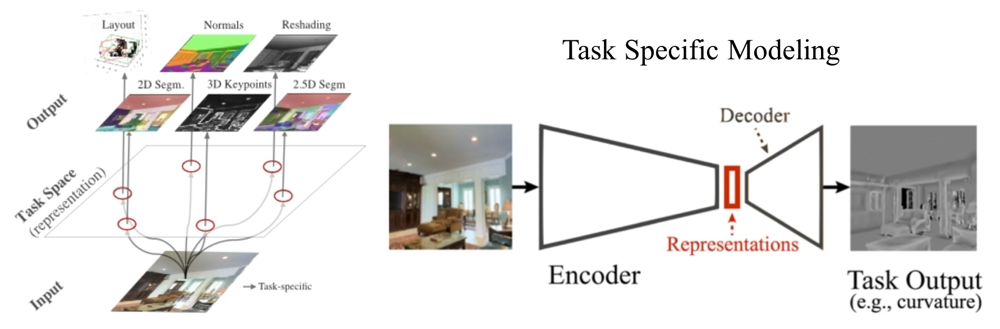
</div>

### Network Architecture

As shown in the figure above, each task shares the same encoder architecture. The encoder maps the input image (256x256) into a representation of size 2048 (16x16x8). Hence the encoder architecture and representation size of all tasks are identical. The encoder is modified based on [ResNet-50](https://arxiv.org/pdf/1512.03385.pdf) by: 1. replacing `conv5_1`'s stride 2 convolution with stride 1 convolution. 2. No global average pooling. 

Also, we trained all of the networks on **the same exact set of input images**, i.e. the pixels seen in the input by all networks are identical and the only difference is in the output space. 

Since the tasks in our dictionary can have different dimensionalities in their output, we have a varying decoder architecture accordingly. We tried to keep the decoder structure compact and varying as little as possible. Also, slighlty different kind of loss could be employed for different tasks accordingly. See the table below for the complete information.

<div align="center">
  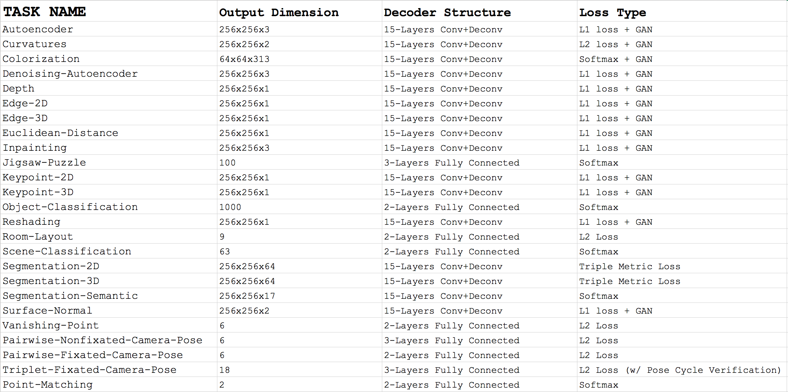
</div>


## Installation

### Step 1: Clone the Code from Github

```
git clone https://github.com/StanfordVL/taskonomy.git
cd taskonomy/taskbank
```


### Step 2: Install Requirements

**Python**: see [`requirement.txt`](https://github.com/StanfordVL/taskonomy/blob/master/taskbank/requirement.txt) for complete list of used packages. We recommend doing a clean installation of requirements using virtualenv:
```bash
conda create -n testenv python=3.4
source activate testenv
pip install -r requirement.txt 
```

If you dont want to do the above clean installation via virtualenv, you could also directly install the requirements through:
```bash
pip install -r requirement.txt --no-index
```

**Tensorflow**: Note that you need [Tensorflow](https://www.tensorflow.org/install/). We used Version 1.5. If you use the above virtualenv, Tensorflow will be automatically installed therein. 


## Running Single-Image Tasks

While in `taskonomy/taskbank` folder:

#### Step 1: Download Pretrained Networks

```
sh tools/download_model.sh
```

#### Step 2: Run Demo Script

To run the pretrained model of a task on a specific image, do:
```bash
python tools/run_img_task.py --task $TASK --img $PATH_TO_INPUT --store $WHERE_TO_STORE
```

For the `--task` flag which specifies the task being run on the query image, find the task name in [Task Name Dictionary](https://github.com/StanfordVL/taskonomy/blob/master/taskbank/tools/task_dict.txt). For example, according to the dictionary:
```
Surface-Normal : rgb2sfnorm
```

Then, we can run the script on our [example image](https://github.com/StanfordVL/taskonomy/blob/master/taskbank/assets/test.png) as such:

```bash
python tools/run_img_task.py --task rgb2sfnorm --img assets/test.png --store assets/test_sf.png
```

<div align="center">
  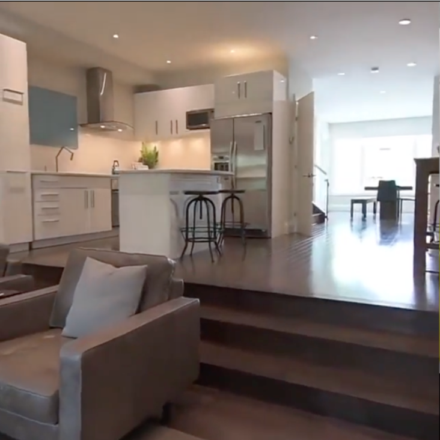
  <p>Example Test Image</p>
</div>

Which will give us image [`test_sf.png`](https://github.com/StanfordVL/taskonomy/blob/master/taskbank/assets/web_assets/test_sf.png):
<div align="center">
  
  <p>Surface Normal Estimation on the Test Image</p>
</div>

Similarly, non pixel-to-pixel tasks which produce lower dimensional (e.g. vanishing points) or classification (e.g. scene classification) outputs uses the same script. For example:
```
Scene-Classification : class_places
```
Again, we can run the script on our example image using:

```bash
python tools/run_img_task.py --task class_places --img assets/test.png --store assets/test_scene_class.png
```

Which will give us image [`test_scene_class.png`](https://github.com/StanfordVL/taskonomy/blob/master/taskbank/assets/test_places.png):
<div align="center">
  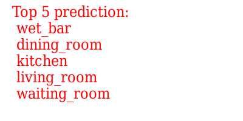
  <p>Scene Classification on Test Image </p>
</div>

Similarly, running `vanishing_point`, `curvature`, `reshade`, `rgb2mist`, `segment25d` on [`test.png`](https://github.com/StanfordVL/taskonomy/blob/master/taskbank/assets/test.png)returns the following results:

<div align="center">
  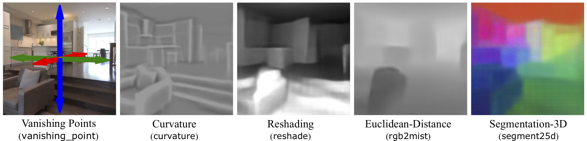
</div>

### Storing Representations
The flag `--store-rep` enables saving the representation of the image prduced by task's encoder. Add `--store-rep` to the command and the representation will be stored at `${WHERE_TO_STORE}.npy`. For example, running:
```bash
python tools/run_img_task.py --task class_places --img assets/test.png --store assets/test_scene_class.png --store-rep
```
will store the representation of `test.png` by the scene classification task encoder at `assets/test_scene_class.npy`.

### Storing Predictions
To save the numerical prediction of the network, e.g. coordiantes of the predicted vanishing points besides its png visualization, use the flag `--store-pred`. Add `--store-pred` to the command and the prediction will be stored at `${WHERE_TO_STORE}_pred.npy`. For example, running:
```bash
python tools/run_img_task.py --task class_places --img assets/test.png --store assets/test_scene_class.png --store-pred
```
will store predicted scene classes at `assets/test_scene_class.npy`.

## Running Multi-Image Tasks

Running tasks with multiple images in their input is pretty similar to the same process for single image tasks.

#### Step 1: Download Pretrained Networks

```
sh tools/download_model_multi.sh
```

#### Step 2: Run Demo Script

To run a pretrained multi-image model on specific images (in case of Triplet-Fixated-Camera-Pose, `--img` should be `$IMG1,$IMG2,$IMG3` since the task requires 3 images in input. See [task definitions](https://github.com/StanfordVL/taskonomy/blob/master/taskbank/assets/web_assets/task_definitions.pdf)), do:
```bash
python tools/run_multi_img_task.py --task $TASK --img $IMG1,$IMG2 --store $WHERE_TO_STORE
```
Similarly for the `--task` flag, find the task name in [Task Name Dictionary](https://github.com/StanfordVL/taskonomy/blob/master/taskbank/tools/task_dict.txt). For example, according to the dictionary:
```
Pairwise-Nonfixated-Camera-Pose : non_fixated_pose
```

Then, we can run the script on our [example image 1](https://github.com/StanfordVL/taskonomy/blob/master/taskbank/assets/test.png) and [example image 2](https://github.com/StanfordVL/taskonomy/blob/master/taskbank/assets/test_1.png) as such:

```bash
python tools/run_multi_img_task.py --task non_fixated_pose --img assets/test_1.png,assets/test.png --store assets/test_pose.png
```

<div align="center">
  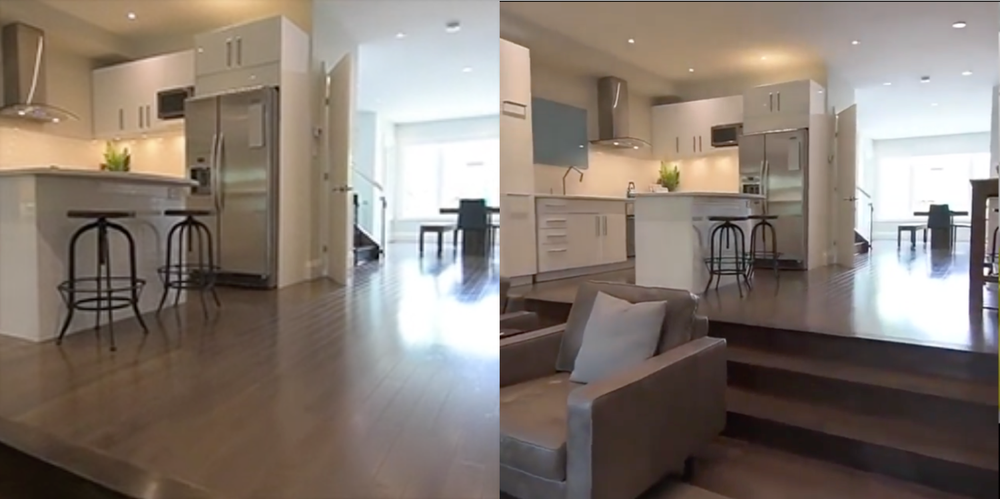
  <p>Camera Pose Estimation - Input Images (left: test_1.png, right:test.png)</p>
</div>

The script will give us [`assets/web_assets/test_pose.png`](https://github.com/StanfordVL/taskonomy/blob/master/taskbank/assets/web_assets/test_scene_class.png):
<div align="center">
  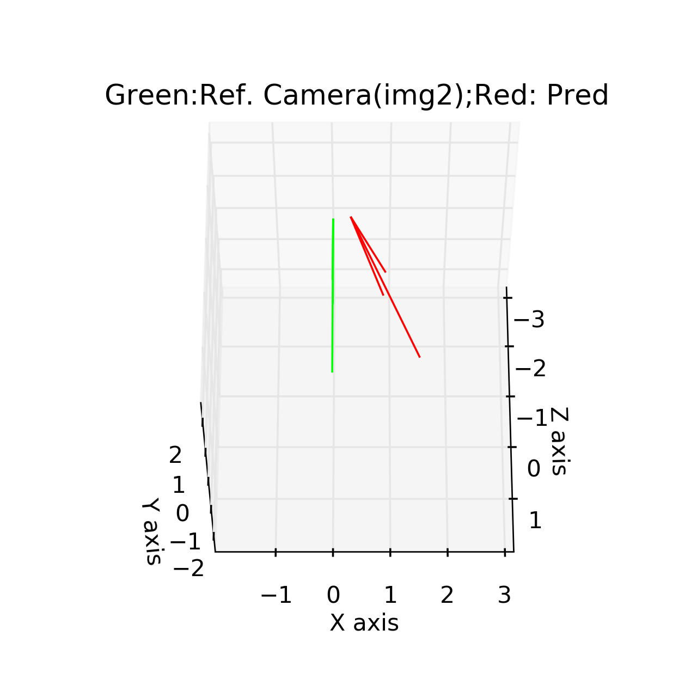
  <p>Camera Pose Estimation (green represents `test.png` 's camera. Red represents `test_1.png` 's.)</p>
</div>

Note: camera pose is calculate with reference to the second image (here that is `test.png`). 

The `--store-rep` and `--store-pred` flags work the same way as in singe-image tasks (described above).

**Point-Matching**: note that the task point matching returns if the center pixels of input images correspond to the same physical point or not (i.e. if they make a "point correspondence") as either 0 (non-matching) or 1 (matching). No visualization is generated for this task and `--store` is used with flags `--store-rep` and `--store-pred` to determine where to save the representation and predicction. See an example below:  

```bash
python tools/run_multi_img_task.py --task point_match --img assets/test_1.png,assets/test.png --store assets/point_match_results --store-rep --store-pred
```

## Evaluation: How good are these networks?
For a complete discussion on the evaluation of the networks, please see the [paper](http://taskonomy.vision/). Overall, the shared networks are often on par or better than per-task customized state-of-the-art. For instnace, we compared our depth estimator network vs. the released models of [Laina2016](https://github.com/iro-cp/FCRN-DepthPrediction) (as of now state-of-the-art on NYU dataset) resulting in 88% `win-rate` for task bank's network on a hold-out test set (after all proper normalizations and whitenings to count for dataset distribution changes across datasets; supported by qualitative results). 

To give an overall idea about the quality of the bank, the table below shows the proportion (%) of a hold-out test set on which the networks in the task bank were able to beat average estimator (`avg`), i.e. the best statistically informed guess, and a network trained on random nonlinear projections (Gaussian representation - `rand`). The numbers denote the good quality of the networks, statistically. Qualititave results run frame-by-frame on a YouTube video can be examined [here](https://taskonomy.vision/#models).  

<div align="center">
  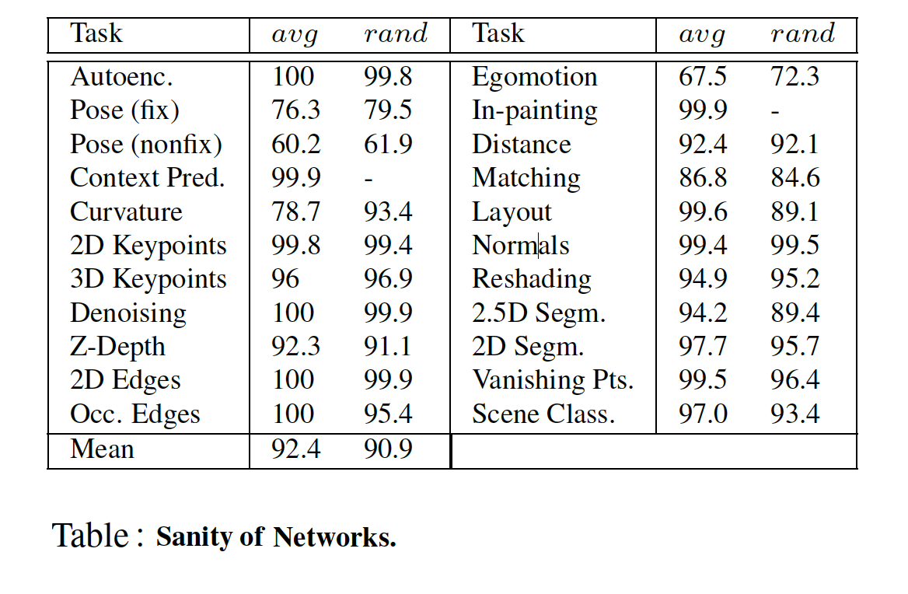
</div>


## Training Data Statistics

The dataset consists of **3.99 million images** from **2265 different buildings**. The images are from **indoor scenes**. Images with people visible were exluded and we didn't include camera roll (pitch and yaw included). Below are some statistics about the images which comprise the training dataset. If your query images severly deviate from these statistics, the performance is expected to degrade. You can see a sample subset of the training dataset [here](http://github.com/alexsax/taskonomy-sample-model-1). 

| Property | Mean | Distribution |
|----|---|----|
| **Camera Pitch** | -0.77° |  | 
| **Camera Roll** | 0.0° | 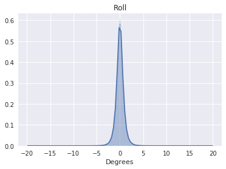  | 
| **Camera Field of view** | 75° | *Constant*  |
| **Distance**  (from camera to scene content)| 5.5m | 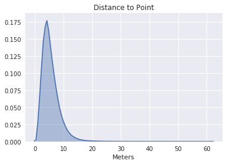  |
| **3D Obliqueness of Scene Content** (wrt camera)| 52.5° | 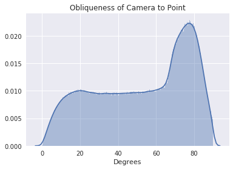  |
| **Points in view** (for point correspondences) | (median) 15 |   |


## Citing

If you find the code or the models useful, please cite this paper:
```
@inproceedings{zamir2018taskonomy,
  title={Taskonomy: Disentangling Task Transfer Learning},
  author={Zamir, Amir R and Sax, Alexander and and Shen, William B and Guibas, Leonidas and Malik, Jitendra and Savarese, Silvio},
  booktitle={2018 IEEE Conference on Computer Vision and Pattern Recognition (CVPR)},
  year={2018},
  organization={IEEE}
}
```

### License

The code and models are released under the MIT License (refer to the [LICENSE](https://github.com/StanfordVL/taskonomy/blob/master/LICENSE) file for details).
 

